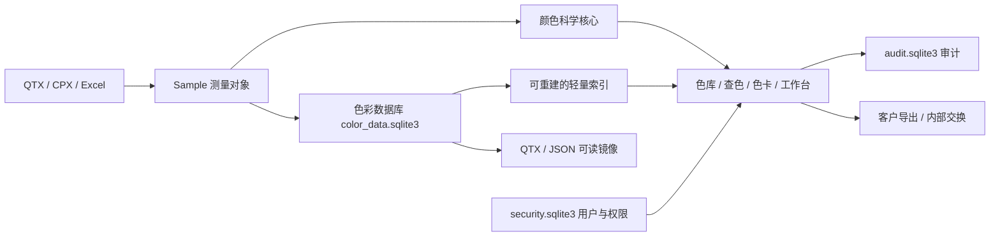

# Chromatic Analysis 项目审查与第一轮整改

审查对象：远端 main 提交 `747e87e5235518ec86be5d535851b1a0c69f303d` 中的 HF142 ZIP。原始 ZIP 保留；修改发生在 `review_working/` 的解压副本。这里区分实测缺陷、已修复事项和后续建议，不把历史 PASS 报告当作当前验收结果。

## 1. 项目定位与内容

这是以纺织品、纱线等实物色样为主要场景的 **Python + PySide6 桌面色彩分析软件**。具有 QTX/CPX/Excel 数据交换、正式/官方色库、查色、比色工作台、色卡编排、光谱与 Lab 3D、色差/同色异谱/555、权限和备份功能。属于有较完整业务功能、需要加强工程化和计量可信度的产品。

压缩包有 524 个条目，其中 505 个文件；压缩约 4.85 MB，展开约 8.56 MB。去掉字节码缓存后，主要有 91 个 Python 文件、133 个 Markdown 文档、122 个文本说明、56 个 Windows 批处理、2 个 CSV、2 个 QTX、QML 和图像资源。大量文档是历史 Hotfix 范围与验证记录，需与当前源码和测试交叉核对。完整清单见 `archive_inventory.json`。

**未发现 Excel 原始业务工作簿、生产 SQLite 数据库或完整客户光谱库。** 两份 CSV 是历史验证结果，而不是当前完整生产数据库。

| 文件/区域 | 内容 | 解释 |
|---|---|---|
| `qtx_core/` | Sample、色度计算、QTX/CPX、平均光谱、色卡排序 | 不依赖窗口的颜色科学与领域逻辑 |
| `qtx_app/` | 主窗口、SQLite 色库、登录权限、Excel、备份、3D | 界面、持久化与工作流 |
| `tools/` | 诊断、性能、排序审计 | 部分依赖外部生产数据，不能仅凭文件存在判定可用 |
| `tests/` | 色度参考、数据交换、索引、UI 等 | 当前可执行自动回归入口 |
| `tests/data/Col.9 FH0092.qtx` | 1 个标准、2 个批次 | 对照多光源、色差、MI 的实测参考 |
| `tests/data/Sun Way.qtx` | 7 个 STANDARD_DATA 记录 | 含转换后的目标 XYZ 和嵌入的比色结果；记录类型与“当前比色标准”不是同一概念 |
| `PAC_HF97_ADIDAS_COLOR_FAMILY_ASSIGNMENT.csv` | 309 条历史分类结果 | 序号、色类、名称、L/a/b/C/h、HEX |
| `PAC_SimpleColorFamily_FULL208_SUMMARY.csv` | 208 个文件的历史统计 | 文件、样本数、耗时、状态、错误、12 个色类计数；合计 35,796 个样本，208 行均标记 PASS |

CSV 汇总的样本数是历史报告覆盖量；ZIP 内实际只有两份 QTX 参考文件，无法独立重跑全部 208 个文件。CSV 中毫秒数据不代表本次云环境性能。

## 2. 数据结构与流向



### 核心测量对象

`qtx_core/models.py` 的 `Sample` 包含：

- 身份：`sample_id`、`display_name`、`kind`（STD/BAT/AVERAGE）。
- 基准坐标：`xyz_d65_10`、`lab_d65_10`，约定为 D65/10°；XYZ 采用 Y=100 标度。
- 光谱：`reflectance` 为百分数，`wavelengths` 为 nm；默认 360–700 nm、10 nm 间隔，实际可导入其他范围。
- 来源/条件：`source_file`、`viewing`、`raw`。`raw` 保存仪器、原始字段和 `ATTR_*` 属性。
- `ColorResult` 表示指定光源下的 XYZ/Lab；`PairAnalysis` 表示标准/批次色差及 MI；工作台另外保存选定的标准 key。

超过 100% 的反射率可能是荧光材料的表观反射因数，不应一律裁剪或判坏。普通反射率模型本身不能完整模拟荧光在不同照明下的表现。

界面常用 key 是“规范化来源路径 | sample_id”；重复实例另有区分。路径参与身份意味着移动文件或跨电脑迁移会影响引用，不能只靠名称或颜色猜测恢复。

### 权威存储与镜像

| 数据域 | 主要表/文件 | 作用 |
|---|---|---|
| 色库 | `saved_qtx` | 来源路径、客户分类、镜像路径、数据状态、责任人及时间 |
| 色样 | `saved_samples` | `sample_key`、`qtx_path`、完整 JSON `payload`；另有 Lab、名称、色类、孟塞尔等派生索引 |
| 排列/界面 | `sample_order`、`column_settings`、`customer_groups` | 排序、列设置、客户分组 |
| 色卡 | `color_cards` | layout/settings JSON、归属、可见性和生命周期字段 |
| 工作台 | `workbenches`、`workbench_samples` | 标准、样本顺序、快照、平均标准、设置和归属 |
| 身份权限 | `users`、`organization_profile`、`user_features`、`data_scope_grants` | 本地 PBKDF2 密码摘要、角色、功能权限与客户范围授权 |
| 审计 | 独立 `audit_log` | 用户、动作、对象、说明、时间 |

DG4 将色彩、身份、审计、运行缓存物理分离，方向合理。SQLite 是运行时权威数据；QTX、`.chromaticcard.json`、`.chromaticworkbench.json` 是可读镜像，不应当作为另一个并行权威源。数据库事务与文件镜像不是天然原子操作，需要恢复机制和可见的同步状态。

用户业务目录含正式色库、色卡方案、个人工作区、数据交换、业务备份和旧版迁移源；系统目录保存 Security、Database、Audit、OfficialLibraries、Runtime 和分域备份。

## 3. 已确认并落实的整改

| 优先级 | 问题与影响 | 本轮处理 |
|---|---|---|
| P0 | 权限读取异常时 MainWindow 将普通用户也置为无限制色库访问 | 抽出 `access_policy.py`；普通用户默认拒绝所有路径，管理员保留修复通道；正常客户白名单仍按规则建立 |
| P0 | 客户 Excel 色卡把成本、配方等任意 `ATTR_*` 写到其他工作表 | 默认不创建内部属性表；只有显式 `include_internal_metadata=True` 才导出；安全测试检查整个工作簿 |
| P0 | CPX A/2° 等坐标直接装入名为 D65/10° 的缓存字段 | 有光谱时按 D65/10° 建立内部基准；保留来源条件；没有足够光谱时明确报错，避免伪造颜色 |
| P0 | QTX 无效/空光谱 token 被跳过，后续反射率绑定到错误波长 | 拒绝损坏 token、NaN/Inf 和点数不符；保留合法末尾逗号支持 |
| P1 | 重复、倒序、非有限波长进入积分，可能静默覆盖光谱点 | 单条与批量计算统一前置校验；保留 >100% 表观反射率 |
| P1 | CPX 缺少 Lab 时出现默认零坐标；导出的坐标与声明条件不一致 | 从有效 XYZ 推导缺失 Lab；新生成及改变条件的模板导出使用声明的光源/观察者计算坐标 |
| P1 | QTX 导出保留旧 STD_TX/TY/TZ，重新导入覆盖已更新目标 XYZ | 同步更新转换目标字段，防止旧 raw 覆盖当前测量对象 |
| P1 | Excel RGB 与显式预览 HEX 不同 | RGB 从实际导出的 HEX 生成，展示和数值一致 |
| P1 | Sun Way 的高精度 Datacolor 对照不通过 | QTX 内嵌 XYZ→Lab 使用参考数据采用的表列 D65/10° 白点 `(94.811,100,107.304)`；不改光谱积分或其他格式白点 |
| P1 | 孟塞尔换算实际需要 SciPy，依赖清单未声明 | 增加 SciPy；修正 colour-science 0.4.7 所要求的最低 Python 为 3.11；验证真实孟塞尔换算 |
| P1 | 历史测试沿用旧显示名、旧 UI API、未初始化权限上下文的假对象 | 更新测试夹具与当前契约；保留索引、保密、选择和快捷键断言；补充空版位与实际色样的区分 |

这些是对解压源码的修改，不是对用户生产库的迁移。客户 Excel 的内部属性默认行为发生变化；需要内部完整交换的调用方应显式选择内部导出。损坏光谱以及无法转换的 CPX 现在会报错，不再静默生成可能错误的数据。

## 4. 尚需推进的弱点与建议

### 颜色科学与计量

1. **测量条件不够结构化。** 把光源、观察者、SCI/SCE、几何、孔径、UV 模式、仪器编号、校准时间、反射率单位、计算来源和算法版本做成独立字段。当前 `viewing/raw` 字符串易丢条件、难以审计；`ColorResult` 也未显式携带观察者。
2. **商业光源是近似 SPD。** U30/U35/Horizon/LEDT8G 已有说明，但不能只靠 tooltip 保证用户理解。结果表和报告应显示“兼容光谱”，支持客户指定实测 SPD、版本及哈希，避免把同色温当作相同光谱。
3. **荧光不是一般反射率问题。** 表观反射率 >100% 只能提供线索；依单条曲线重算其他光源不能保证有效。应区分 UV 条件与测量能力，并对相关 MI/多光源结论标注适用性；需要仪器相应测量支持。
4. **失败时不能冒充选定条件。** 当前 `sample_lab` 等路径可能在重算异常时回退 D65 缓存。下一轮应显示 N/A/不可计算并禁用该条件下的生产判定，保留明确来源标签。
5. **白度、Tint 与 MI 要交代适用范围。** 数学值不等于有效白度评价；深色样的白度指标不宜作为合格判定。MI 的公式、参考/测试光源和观察者应随报告保存，标准符合性需要正式版本依据及更多实测参考。
6. **显示预览与实物判定必须分开。** 当前 Lab→sRGB 在多处重复，且输入可能是 10° Lab、使用的屏幕转换是 2° RGB 约定；荧光还有不同裁剪策略。建立统一预览模块，记录 gamut mapping/超色域状态，逐步支持 ICC 与校准显示；不把 HEX 当作仪器真值。

### 系统与数据可靠性

- 主窗口原有约 **15,737 行、54 个类、1,025 个函数/方法**。将窗口承载、导入、查询、色库、工作台、色卡、导出拆为明确模块；先以现有回归覆盖逐块迁移，避免一次性重写。
- 多个历史排序版本和几十个启动脚本共存。保留迁移/历史说明，但发布入口、版本号、依赖和验证程序应只有一套当前权威配置。`pyproject` 中旧项目版本与产品版本、旧 VERIFY_RELEASE 常量仍需统一。
- Sample 的路径身份应升级为稳定 measurement UUID + source asset ID；移动位置作为属性。跨文件 GUID 碰撞、重复实例、来源恢复必须有明确定义。
- JSON payload + 派生索引对当前规模实用，但关系约束和迁移版本管理应加强。分域身份不能靠跨库外键自动保证一致性；完整性检查应覆盖孤儿引用和业务约束。
- 将镜像写入变成“事务提交 + 待同步任务/outbox + 原子文件替换 + 可重试”的工作流，显示同步失败，避免异常吞掉之后看起来已保存。
- 本地 RBAC 适合应用内权限；有操作系统文件访问权的人仍可能直接读取业务镜像/数据库。应结合文件 ACL、加密及组织分发策略，不能把本地登录误称为完整数据安全边界。
- `.cadata` 导入与备份恢复应增加版本、文件哈希、路径检查、分域恢复演练和故障注入；本轮没有生产数据库，所以未做真实升级和灾难恢复验收。

### UI / 交互

本轮实际运行并截图了 1366×768 色库窗口，见 `review_evidence/ui-1366.png`。观察到小字号、多个筛选/标题层、色块间距较大；截图环境的字体与真实 Windows 有差异，中文/品牌文字效果需 Windows 复核。

建议按业务任务整改：

- 让“导入 → 选标准 → 比色 → 判定 → 导出”形成可见流程；查色、比色、编排有独立上下文。
- 数据区固定显示光源、观察者、标准、公式及容差，不让关键测量条件仅藏在菜单中。
- 增加紧凑/标准密度，主正文 12–14 px，关键指标更醒目；减少重复标题与大块留白，保留可读色名与数值。
- 小屏以单工作页为主，大屏提供对比布局；保留 MDI，但不以多窗口状态作为必需学习成本。
- “隐藏”和“删除”分开，持久删除提供明确对象、权限、影响说明；日志与可恢复删除优于不可逆误操作。
- 色差合格/超差同时有文字/图标与颜色，提供键盘操作、缩放和无障碍名称；不可仅靠红/绿提示。
- 色块统一标明“屏幕预览”，超色域、近似光源、缺失光谱和荧光条件有可见提示。

本轮没有把 UI 建议冒充完成的重设计；优先交付了会影响数值、数据和权限的确定性修复。

## 5. 验证与使用

基线：原有测试 **115 通过、15 失败**。新增完整性用例在修改前 **14 失败、3 通过**；Excel 新用例也复现了泄露和 RGB/HEX 不一致。整改后全套回归 **154 项全部通过**，结果见 `review_evidence/final-tests.txt`。没有删除失败测试、降低 Datacolor 精度要求或把失败标为跳过。

实际 Qt 主窗口完成启动、QTX 解析、SQLite 保存/读取、正式色库切换；security/colour/audit 三库 `PRAGMA quick_check` 通过。孟塞尔换算安装 SciPy 后通过。Qt 验证使用独立 `/workspace/chromatic-runtime/` 数据目录，没有操作用户生产数据。

云环境运行方法（解压源码目录下）：

```bash
/workspace/chromatic-venv/bin/python -m pytest
QT_QPA_PLATFORM=offscreen \
XDG_CONFIG_HOME=/workspace/chromatic-runtime/config \
XDG_DATA_HOME=/workspace/chromatic-runtime/data \
XDG_CACHE_HOME=/workspace/chromatic-runtime/cache \
/workspace/chromatic-venv/bin/python tools/review_smoke.py
```

测试 UI 时同样设置上述 Qt/XDG 变量。`requirements-review-lock.txt` 记录本次 Python 3.12/Linux 实际验证版本；其他平台请先按 `requirements.txt` 安装并做平台回归。Windows 正常启动入口仍为 `python main.py`，需正常登录/首次创建管理员。

**未验证事项：** Windows 安装包、真实 GPU/3D、实际仪器与客户 SPD、全部 208 个原始文件、生产数据库迁移和备份恢复、真实显示器颜色管理。本轮通过不等于已完成 v1.0 发布认证。

交付：原始 ZIP、解压整改源码、`review_fixes.patch`、修复副本 ZIP、归档清单和测试证据。修复包是审查版，未发布、未推送远端。

云环境 `install_script` 与 `start_skill` 已保存为草稿，尚未发布。若需要在后续任务恢复此环境，请在环境设置中审阅并保存，然后发布。
